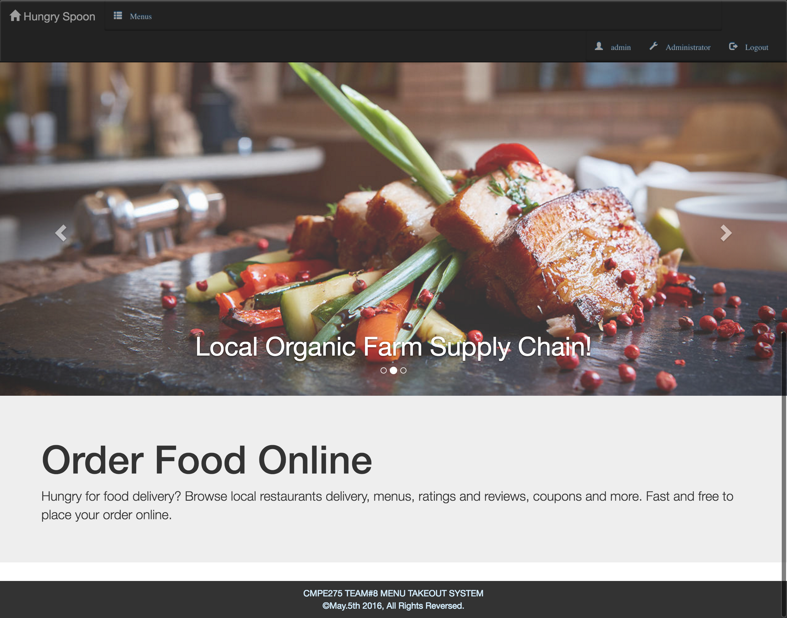
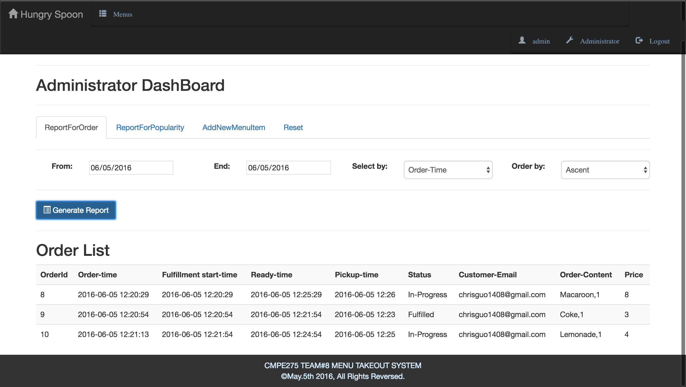
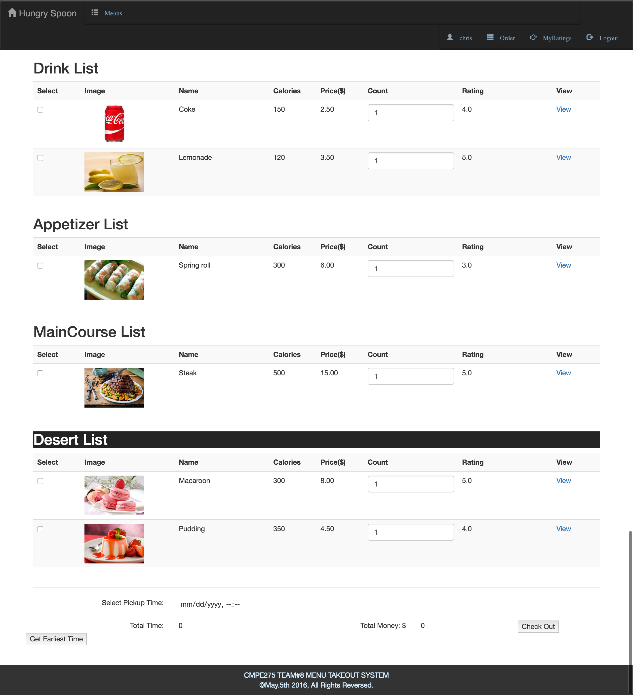
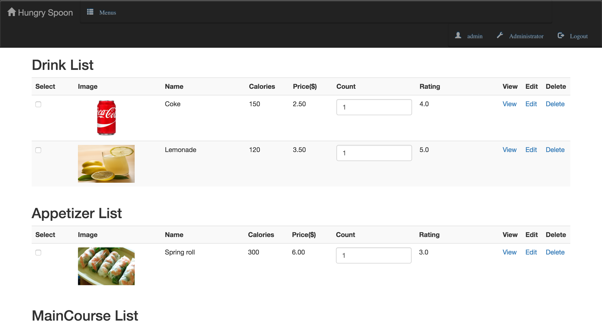
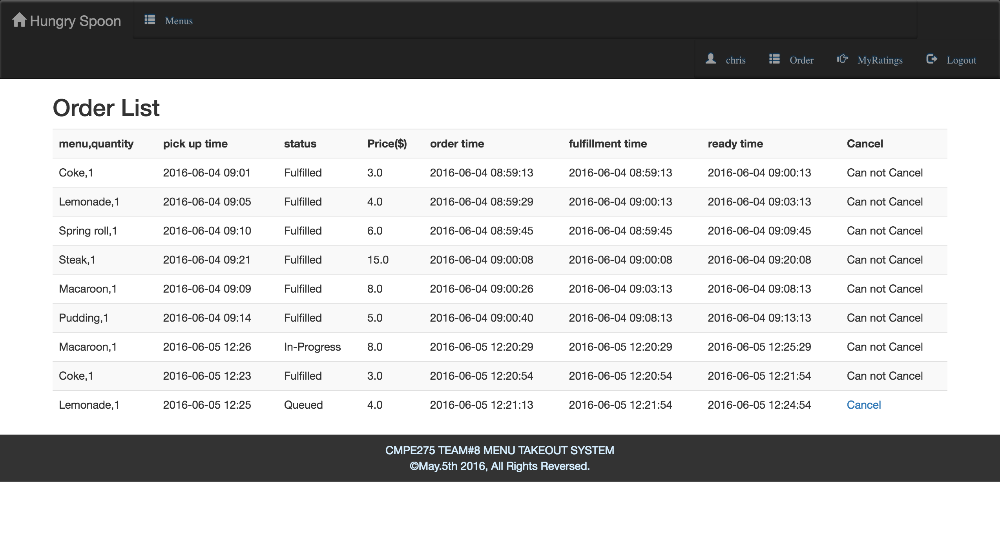
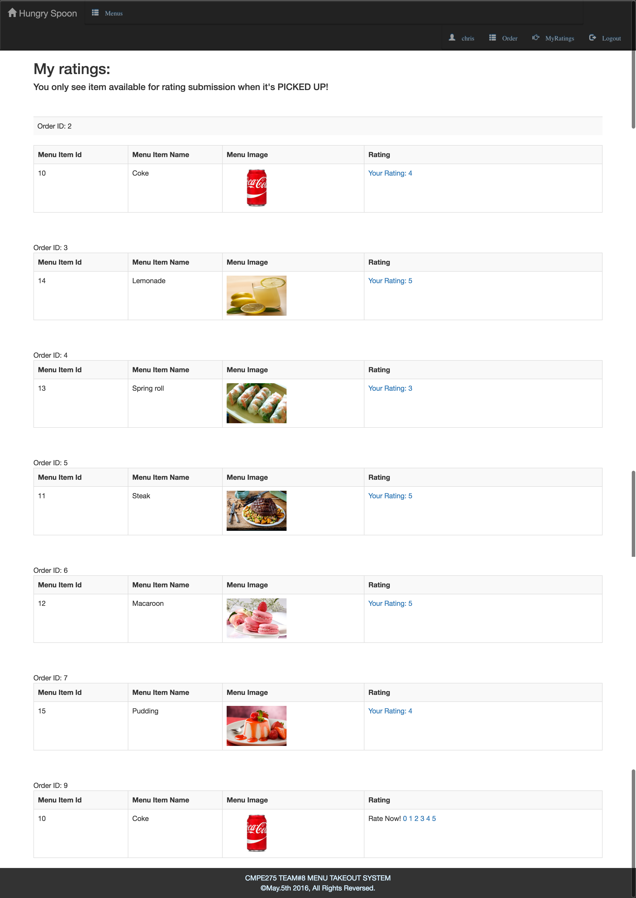

# README #
Hungry Spoon is cloud based meal ordering service system. It's built with Spring framework, utilizing features including Spring Boot, Spring MVC, Spring Security, Spring Data. The system provides functionalities including user registration, registration confirmation with email, ordering at specific time, available time query, time conflict management, rating of menu items, order reporting system, etc. 

The system runs on Amazon AWS EC2 instances.

Screenshots:

###front page

###admin page

###menu page 1

###menu page 2

###order page

###rating page

